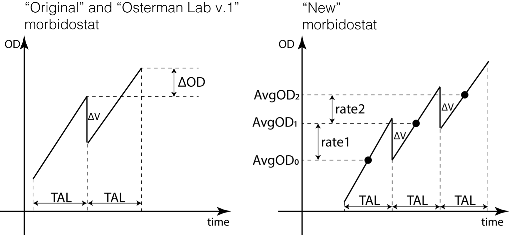
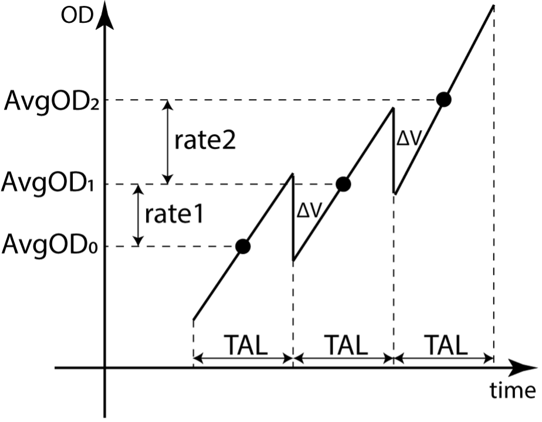
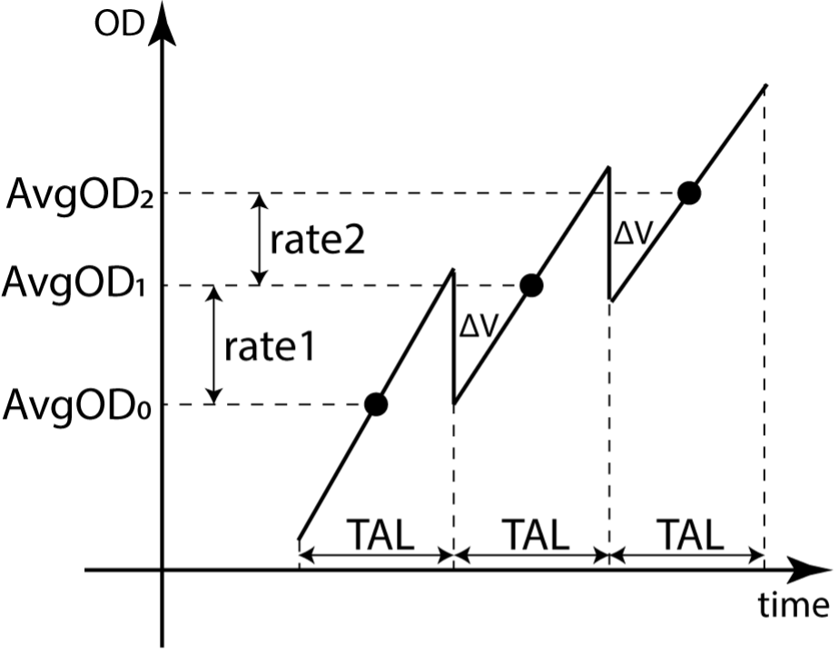
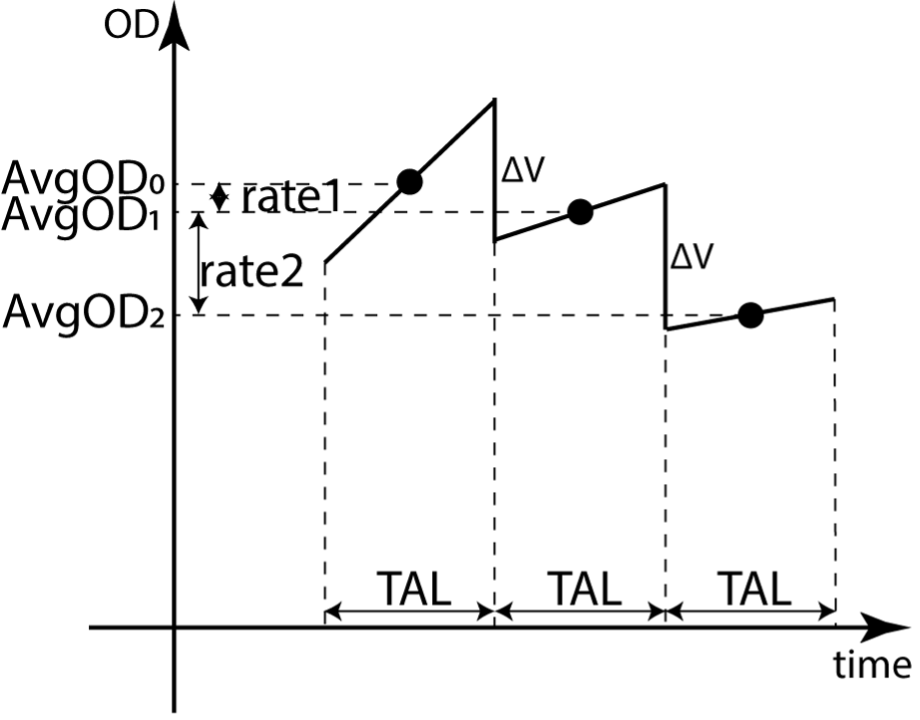
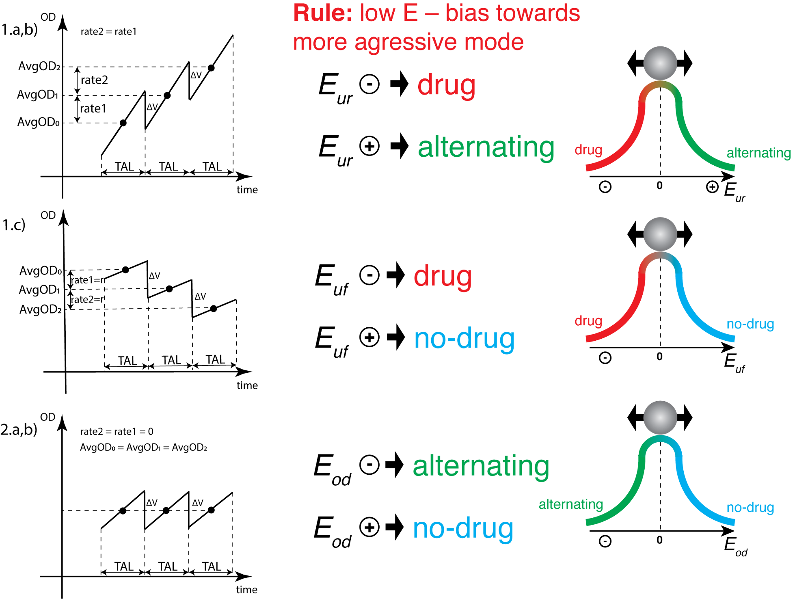
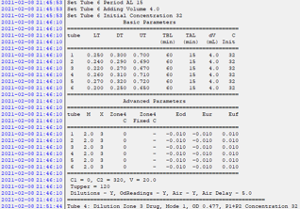
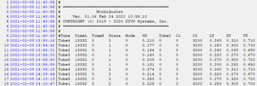
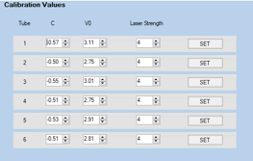

# Morbidostat software upgrade.

Document describes the second version of the morbidostat device from Osterman Lab.
Software was implemented by [DIVO Systems](http://divo.com/).

## Motivation

The original morbidostat algorithm was proven to drive evolution of
antibiotic resistance in bacteria in effective and robust way. However,
we decided to add flexibility in the control software to address two
main issues of the “original” morbidostat approach that was implemented
in the previous version of the morbidostat device:

1)  The “original” approach is comparing growth rate with dilution rate.
    However, if a drug has a delay in action this method to control
    culture density can lead towards excessive addition of the drug and
    results in the crash of the culture.

2)  Drug addition to the reactor is defined by stock concentration as
    displacement volume and cycle time cannot be changed during the
    experiment without disruption in the work of algorithm. Often drug
    resistance evolve fast with large increase in MIC. To address
    changes in MIC an operator needs to change drug stock every time
    when culture stops responding to the drug.

3)  Using concentration of the drug stock as the main factor defining
    scale of the drug administration brings an additional challenge.
    When using multiple reactors with various pace of evolution towards
    resistance some reactors could receive not enough drug and others –
    too much.

4)  In the “original” approach culture is only limited by drug. If it
    will be resistant to the current maximum achievable drug
    concentration, then it will grow until it’s growth rate will match
    dilution rate. This can result in very high density of the culture.

## Improvements in the fluidics control

To address the issue with control of the drug concentration in the
dilutions we mix of two media (no-drug and drug-containing) each time
when software decides to add a drug into reactor. Technically it was
achieved by the following:

1.  Tubing for each type of media for each reactor is controlled by a
    separate pinch valve. In our case 6 reactors have 2 inputs each
    resulting in 12 pinch valves.

2.  If software decides to add drug it:
    
    1.  based on the stock concentration and displacement volume
        calculates volume of drug and drug-free media that should be
        mixed;
    
    2.  open pinch valve of the drug media tubing;
    
    3.  engage pump for drug media (Pump 2)
    
    4.  close pinch valve;
    
    5.  open pinch valve of the drug-free media tubing;
    
    6.  engage pump for drug-free media (Pump 1);
    
    7.  close pinch valve.

Example:

We usually using 20% displacement volume from 20mL reactor volume which
is 4mL. We trust our pumps to administer 400uL volume (10% from
displacement volume). If we want to make 1xMIC in the reactor with one
dilution we can setup the software to add 400uL of drug media and 3600uL
of drug-free media. Then in the stock we can keep 0.4 \*
Cpump2 / 20 = 1xMIC =\> Cpump2=50xMIC. Therefore,
we can achieve up to 50xMIC in the reactor without changing media
bottles. In the “original” setup 50xMIC bottle will cause 10xMIC with
one dilution. The concentration could be decreased with subsequent
dilutions, but typical time between dilution in 15min will likely cause
culture to crash.

## Proposed algorithm: optical density thresholds

The basis of the algorithm is similar to the “original” morbidostat
approach:

  - once in **fixed time interval (usually 15min)** do a dilution with
    **fixed volume (usually 4mL).**

  - Choose mode of action based on the culture optical density (OD)
    (Figure 1). For this change we propose three thresholds:
    
      - Lower threshold (LT)
    
      - Drug threshold (DT)
    
      - Upper threshold (UT)

Figure 1. Comparison of modes of action allocation in three
implementations of morbidostat approach: 1. “original” morbidostat
approach described by Toprak et. al. uses one threshold: below this
threshold software uses only drug-free media, above – choses between
drug (id growth rate is greater than dilution rate) and no-drug media
(if growth rate is lower than dilution rate); 2. first implementation of
morbidostat in the Osterman Lab added additional threshold where
low-density culture diluted with an extended time between dilutions
(usually 60min); 3. the novel algorithm (see in text below).

These thresholds provide 4 modes of action for morbidostat (Figure 1):

1.  Culture OD \< LT: Culture is diluted
    with fresh no-drug media using prolonged cycle time (TBL – time
    between dilutions below lower threshold). The aims of this mode:
    
    1.  prevent culture washout if will crash after antibiotic exposure;
    
    2.  support culture growth in the lag phase in the beginning of the
        experiment.

2.  LT≤ Culture OD \< DT: Culture is
    diluted with fresh no-drug media using standard cycle time (TAL –
    time between dilutions above lower threshold). The aim of this mode
    is:
    
    1.  wash culture from the drug;
    
    2.  restore culture growth rate.

3.  DT≤ Culture OD \< UT: Culture is
    diluted with drug or with no-drug media based on the culture
    behavior (see below). The mode:
    
    1.  keeps selection pressure for evolution of resistance.

4.  UT≤ Culture OD: Culture is forbidden
    to grow above UT.
    
    1.  If culture reaches UT it will be diluted with short dilutions
        until Culture OD ≤ DT.
    
    2.  After culture reaches UT algorithm considers that the current
        level of drug is insufficient to control growth. It increases
        drug concentration in dilutions until it become equivalent to
        concentration in the stock.

## Proposed algorithm: automatic drug administration

In the drug mode software decides if it should increase of reduce drug
concentration in the culture. The general idea is to keep culture OD by
drug concentration. For this purpose the “original” algorithm compares
OD before it makes a dilutions (Figure 2). If ∆OD \> 0 than growth rate
is greater than dilution rate and “original” algorithm added drug,
otherwise it added fresh media to support growth and decrease drug
concentration. From our experience we see that this approach misses much
of signal from the culture behavior as for a lot of drugs the culture
response is delayed and gradual. Therefore, the main idea to **utilize
changes in growth rate** **as a primary signal for drug
administration**.

Figure 2. Comparison of the drug administration algorithms. At the end
of the current time interval (TAL) algorithm decides what media it
should add to the culture. The “original” looks on the difference
between last OD measurements of the current and last intervals (∆OD);
The novel algorithm works with the logic explained below.

The following logic was implemented:

> if (rate2 \> rate1 + (AvgOD2 \>
> AvgOD1 ? Eur : Euf\])):
> 
> dilute with drug (mixture of Pump1 and Pump2)
> 
> if (AvgOD2 \> AvgOD1 + Eod):
> 
> dilute alternating drug (mixture) and no-drug media
> 
> else:
> 
> dilute with no-drug media

where:

> AvgOD2 – average OD on the current interval between
> dilutions;
> 
> AvgOD1 – average OD on the previous interval;
> 
> AvgOD0 – average OD on the two intervals before;
> 
> rate2 = AvgOD2 - AvgOD1 – proxy for
> growth rate determination in the current interval;
> 
> rate1 = AvgOD1 – AvgOD0 – proxy for
> growth rate determination for previous interval;
> 
> Eur – bias coefficient if culture increase OD;
> 
> Euf – bias coefficient if culture decrease OD;
> 
> Eod – bias coefficient for comparison AvgOD1 and
> AvgOD2.

Examples:

For next three examples we suppose that bias coefficients are equal to
zero.

1.  **Culture is growing with acceleration (Figure 3)**

> 
> 
> Figure 3. Culture growth with acceleration.
> 
> rate2 \> rate1 =\> the first condition in the
> algorithm logic is true.
> 
> Software signals to add mixture of drug and no-drug media.

2.  **Culture grows, but decelerates (Figure 4)**

> 
> 
> Figure 4. The culture still growing, but drug started to work, and
> growth rate decreased.
> 
> rate2 \< rate1 =\> the first condition is false,
> go to the second conditions.
> 
> AvgOD2 \> AvgOD1 =\> the second condition is
> true.
> 
> Software starts alternating drug and no-drug mode. In setup user can
> define the length of the sequence X. Sequence is built by one drug
> dilution and X-1 no-drug dilutions. If the previous dilution was a
> drug dilution, then the software will do X-1 no-drug dilutions and
> then add drug. If the last dilution was no-drug dilution, then
> otherwise one drug dilution will be added following by X-1 no-drug
> dilutions. For example, if X=3 and previous dilution was drug
> dilution, then the following sequence of operations will happen:
> 1st – no-drug dilution; 2nd – no-drug dilution;
> 3rd – drug dilution.
> 
> Note that each time algorithm still looks on the full condition logic
> and can break the alternating sequence.

3.  **Culture growth rate is lower than dilution rate (Figure 5)**

> 
> 
> Figure 5. Culture growth rate became low and culture OD is falling.
> 
> rate2 \< rate1 =\> the first condition is false,
> go to the second conditions. Although rate2 is greater by
> absolute value it will have a negative sign and therefore be lower
> than rate1.
> 
> AvgOD2 \< AvgOD1 =\> the second condition is
> false.
> 
> Software will administer no-drug media.

## Proposed algorithm: bias coefficients

Figure 6. Borderline situations. Situations when decision logic is
highly unstable. Three bias coefficients (Eur,
Euf, Eod) were introduced to push morbidostat
towards desired behavior. The general rule: coefficient greater than 0
leads towards more aggressive drug administration. Subplots numbered
according text below.

Three bias coefficients were proposed to guide algorithm in borderline
situations (Figure 6). Each borderline situation has high variance as
even small errors in OD measurements can switch morbidostat behavior.
Bias coefficients push morbidostat towards desired behavior.

1.  What to do if rate1 = rate2?

The answer depends on the culture behavior:

1.  If culture is growing faster than it is diluted (AvgOD2
    \> AvgOD1) – likely we want to add more drug.

> We setup Eur \< 0 =\> = rate2 \>
> rate1 + Eur is true=\> drug will be
> administered.

2.  If culture is growing faster than it is diluted (AvgOD2
    \> AvgOD1), but we want to make drug administration less
    aggressive.

> We setup Eur \> 0 =\> rate2 \> rate1
> + Eur is false =\> AvgOD2 \> AvgOD1
> is true =\> drug will be administered in the alternating regime.

3.  If culture is growing slower than it is diluted (AvgOD2
    \< AvgOD1) likely we will want to add no-drug media.

> We setup Euf \> 0 =\> rate2 \> rate1
> + Euf is false =\> AvgOD2 \> AvgOD1
> is false =\> no-drug media will be added.

2.  What to do if AvgOD2 = AvgOD1?

<!-- end list -->

1.  If we want to support a culture and think that this situation is
    likely due to the errors in OD reading, but in reality OD is falling
    (the true AvgOD2 = AvgOD1 situation should
    handled by Euf) =\> setup Eod \> 0 =\>
    AvgOD2 \> AvgOD1 + Eod is false =\>
    no-drug media will be added

2.  If we want to be more aggressive and think that this situation is
    more likely due to plato situation =\> setup Eod \< 0 =\>
    AvgOD2 \> AvgOD1 + Eod is true =\>
    alternating regime is engaged. Additionally aggressiveness could be
    increased by shortening the sequence X (X=1 is equal to drug
    administration).

## Software interface

The software interface was built using MegunoLink Pro interface builder
(<https://www.megunolink.com/>). The interface contains several panels
that can be arranged as tabs, panes or separate windows:

1)  OD plot panel (Figure 7)

2)  Connection Manager (Figure 8)

3)  Main Control (Figure 9)

4)  Experiment Settings (Figure 10)

5)  Message Monitor (Figure 11)

6)  Debug (Figure 12)

7)  Pumps Monitor (Figure 13)

8)  Calibration (Figure 14)

9)  Logs (Figure 15)

OD plot panel displays OD values received from reactors.

> 
> 
> Figure 7. Optical Density plot panel. Contains: (1) OD plots; (2) the
> instrument menu that allow to move plots, zoom in/out, save plot data
> and clean plot space; (3) table of plot stats that allows to turn
> on/off display of the plot for particular reactor.
> 
> 
> 
> Figure 8. Connection Manager. Required for connection to Arduino.
> 
> 
> 
> Figure 9. Main Control. The panel contains main indicators and
> settings to start, pause or stop an experiment. The sub-panes
> description:

1.  Manual interventions settings.
    
    1.  Active – set active reactors (“green” checkbox) where experiment
        will be running.
    
    2.  Set Concentrations – change current dilution concentrations for
        drug administration.
    
    3.  Volume/Manual Dilution Concentration – setup volume that was
        sampled from the reactor and concentration of drug in the
        replacement media.

2.  “OD Readings Only” button turns on OD readings without dilutions.

3.  Morbidostat experiment control. “Start” button – start experiment.
    After start of the experiment switches with the “Stop” button. It
    stops OD readings and dilutions. “Pause” button – pause experiment
    (no dilutions of OD readings). The “Pause” button has the same
    action as the “Stop” button. “Init Params” checkbox overrides
    current dilution concentrations with concentrations “C” from the
    “Experimental Settings” panel and set current reactor
    concentrations as 0.

4.  Cleaning mode. Dilutions are made for all selected reactors using
    dilution volume from the “Experiment settings” panel. There is no
    wait time between dilutions. “\# of Cycles” set number of dilutions
    that each reactor will receive.

5.  Interval between subsequent OD readings from a reactor.

6.  Checkbox to turn on/off the Air pump.

7.  During dilution Air pump is turned off. Air delay sets additional
    time of turned off air to avoid media displacement and allow better
    mixture.

8.  Thermostat settings
    
    1.  On/Off - checkbox to turn on/off thermostat.
    
    2.  Current - current temperature in °C.
    
    3.  Min/Max - minimum/maximum observed temperature.

9.  Concentrations and Valves
    
    1.  Dilution Concentration. Concentration of the drug in the
        dilution volume (e.g. 4mL).
    
    2.  Valves. Green indicator - valve is open.
    
    3.  Tube Concentration. Computed drug concentration in a reactor.

10. Heartbeat – indicate status of Arduino connection.
    
    1.  Blinking indicator - Arduino is connected.
    
    2.  Red indicator - Arduino is disconnected.
    
    3.  Green stable indicator - The connection was broken.

11. Status of main morbidostat control equipment. If indicator is green
    – the equipment is engaged:
    
    1.  P1 – Pump 1
    
    2.  P2 – Pump 2
    
    3.  Air – Air pump
    
    4.  Heat – Heating element

Figure 10. Experiment Settings.

1.  Main settings:
    
    1.  LT – Lower OD threshold.
    
    2.  DT – Drug OD threshold.
    
    3.  UT – Upper OD threshold.
    
    4.  TBL – Time between dilutions below lower threshold in minutes.
    
    5.  TAL – Time above dilutions below lower threshold in minutes.
    
    6.  dV – Dilution volume in mL.
    
    7.  Initial C – Initial concentration in dilution volume. Abstract
        units. Should match C1 and C2 parameters,

2.  Concentrations in bottles and reactor volume.
    
    1.  C1 – Drug concentration in Pump 1 bottle. For case when it will
        contain drug.
    
    2.  C2 – Drug concentration in Pump 2 bottle.
    
    3.  V – reactor volume, mL.

3.  Interval between dilutions for the case when culture reaches UT. The
    culture diluted with this interval (typical 2 minutes) until it
    reaches DT.

4.  Advanced parameters:
    
    1.  M – Current concentration multiplier. When culture reaches UT
        and dilution that should bring culture OD to the DT level
        started the current dilution concentration is multiplied by this
        number.
    
    2.  X – Sequence length for alternating mode.
    
    3.  Zone4 C – If we want to dilute culture with some fixed drug
        concentration after it will reach UT we can set this
        concentration here.
    
    4.  Zone4 C Fixed – Checkbox that turns on dilution with Zone4 C
        concentration.
    
    5.  Eod, Eur, Euf – Bias
        coefficients.

Figure 11. Message monitor. Log of all actions that were performed with
morbidostat software. Also contains output that could be produced from
the “Debug” panel.

Figure 12. Debug Panel. Contains checkboxes that turn on/off valves,
pumps and heating element. These controls override morbidostat program.
If a valve of other equipment was engaged by morbidostat program the
checkbox is checked automatically. “Print Experiment Params” button
prints table of the current experiment settings in the Message Monitor
(Figure 11). “Print Run Status” prints table of current dilution
concentration, current reactor concentration, last average OD, Zone
(position of average OD relative to the OD thresholds) and mode (mode of
morbidostat action in the current interval).

“Print OS Statistics” is used for software debug. “Factory Reset” resets
Arduino to default parameters.

Figure 13. Pumps Monitor. Running log of pumps engagements. Each time
when software initiate dilution the following information is written in
this log:

  - Tube – Name of reactor where dilution is initiated.

  - TimeL – Time of Pump 1 work in milliseconds.

  - TimeH – Time of Pump 2 work in milliseconds.

  - State – what mode of action should be used for dilution decision:
    
      - 1 - No-drug growth support
    
      - 2 - No-drug
    
      - 3 - Drug
    
      - 4 - Forced dilution after culture reaches UT

  - Mode – Mode of drug administration:
    
      - 0 – No drug
    
      - 1 – Drug
    
      - 2 – Alternation drug and no-drug
    
      - 3 – Forced dilution (typically the same as no-drug)

  - OD – Average OD on the interval.

  - TubeC – Drug concentration that will be achieved after dilution.

  - C1 – Concentration in the Pump 1 bottle.

  - C2 – Concentration in the Pump 2 bottle.

  - LT – Current lower threshold.

  - DT – Current drug threshold.

  - UT – Current upper threshold.

Figure 14. Calibration Panel. To read OD from reactors we use
photodiodes. Photodiodes produce output in voltage. To convert voltage
(V) to OD we use the following equation OD = C \* log(V) +
V0. The “C” and “V0” coefficients are calculated
from the linear regression OD \~ log(V) based on the measurements of
calibration solutions.

Figure 15. Logs. Three tabs that specify output files for “OD
measurements” log, “Pump Monitor” log and “Message Monitor” log.

## Example of morbidostat setup

Let’s imagine experiment with drug X that has MIC=1mg/L and we will use
6 reactors.

We made Pump 1 media as no-drug media and Pump 2 media containing
500xMIC=500mg/L.

We can specify thresholds LT = 0.1, DT = 0.2, UT = 0.6.

1.  Check all checkboxes to activate all reactors on the Main Control
    panel.

2.  After morbidostat reactors will be filled with media turn on Heat
    checkbox to warm optics.

3.  Turn on “OD READING ONLY” and in about 20 minutes read zero OD
    readings.

4.  On Experimental settings panel setup for each reactor:
    
    1.  LT = zero + 0.1
    
    2.  DT = zero + 0.2
    
    3.  UT = zero + 0.6
    
    4.  TBL = 60
    
    5.  TAL = 15
    
    6.  dV = 4
    
    7.  Initial C = 50. In the current implementation of algorithm C is
        integer number and we need to use numbers proportional to the
        real concentrations). We want 5xMIC in dilution volume as we
        displace 20% which will result in 1xMIC after the first
        dilution.

5.  Set:
    
    1.  C1 = 0 (as we have no drug in the Pump 1 media)
    
    2.  C2 = 500 (equivalent to 50mg/L)
    
    3.  V = 20 (20mL of reactor volume)

6.  For each reactor set advanced parameters:
    
    1.  M = 2. When culture will reach UT the current dilution
        concentration “C” will be increased to 2\*C (first time it will
        be 2 \* 50 = 100).
    
    2.  X = 3. Alternating mode sequence will contain one drug dilution
        and two no-drug dilutions.
    
    3.  Zone4 C = 0 and “Zone4 C Fixed” unchecked. Forced dilutions
        after culture reach UT will be made with no drug.
    
    4.  Eod = -0.01. The bias between alternating regime and no-drug
        regime will be towards alternating regime.
    
    5.  Eur = -0.01. When culture will rise (average OD on the current
        interval will be greater than average OD on the previous
        interval) the bias between alternating regime and drug regime
        will be towards drug regime.
    
    6.  Eur = 0.01. When culture will fall the bias between drug regime
        and no-drug regime will be towards no-drug regime.

7.  Set log files paths. Enable “Insert time stamp” for each log (clock
    icon).

8.  Turn on logging (icon with pencil and paper).

9.  Before inoculation turn off “OD READINGS ONLY”.

10. After inoculation check “Init Params” box and click on the “Start”
    button on Main Control/Morbidostat panel.
